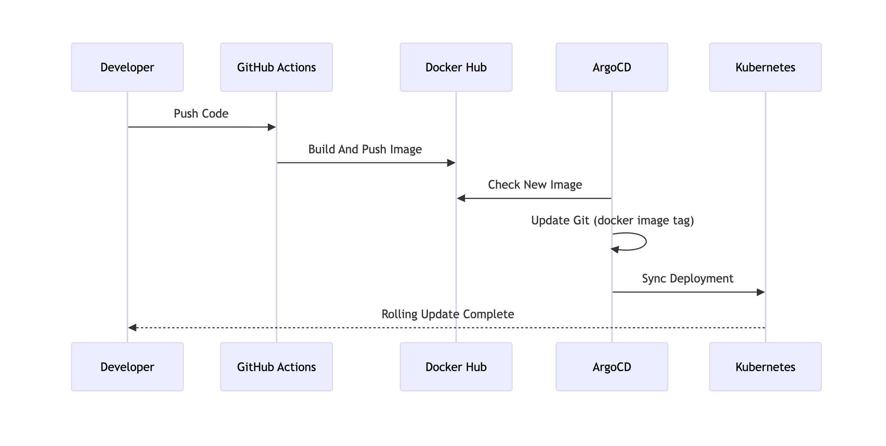

# Kubernetes Deployment Lab

## Overview



Helm과 ArgoCD를 활용하여 GitOps 기반의 배포 환경을 구성하는 리포지토리입니다. 또한 ArgoCD Image Updater를 통해 CI와 CD를 분리하여 운영합니다.

## Project Structure

```shell
├── argocd/
│   ├── applications/       # Application manifests
│   ├── appprojects/        # Project configs
│   └── install/            # ArgoCD installation values
│       ├── dev/
│       │   ├── core/
│       │   └── image-updater/
│       ├── stg/
│       │   ├── core/
│       │   └── image-updater/
│       └── prod/
│           ├── core/
│           └── image-updater/
├── charts/                 # Helm charts
│   ├── order-service/
│   └── user-service/
├── manifests/              # Raw K8s manifests (practice)
├── script/
│   ├── cluster/kind/       # Local cluster setup
│   ├── gitops/argocd/      # ArgoCD setup
│   └── infrastructure/     # AWS EKS, ALB Ingress Controller..
└── helmfile.yaml
```

## Prerequisites

- kubectl v1.35.1
- Helm v4.1.1
- Helmfile v1.3.1
- AWS CLI 2.33.28
- Docker v29.2.1